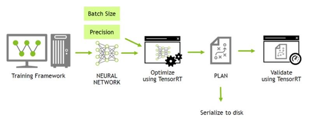
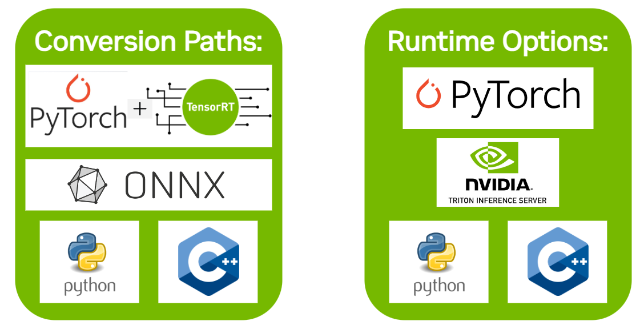

## The Deployment of Artificial Intelligence and Deep Learning Models

> Modern C++ and Python Script to Accelerate and Optimize Artificial Intelligence Models and Deep Neural Networks, and Deploy the Models for Image Processing, Computer Vision and Machine Vision, such image Super-Resolution, YOLO serials detection.





### Features
- [x]Pytorch model ---> ONNX graph ---> TensorRT Engine ---> Deploy GPU Accelerate
- [x]TensorRT
- [x]CUDA kernel function
- [x]Convert Pytorch and TensorFlow models into Onnx


### Quick Start
```shell
git clone DeepLearningDeployment
cd DeepLearningDeployment

cmake -S . -B build -G "Visual Studio 17 2022" -DCMAKE_BUILD_TYPE:STRING=Debug
cmake -S . -B build -DCMAKE_BUILD_TYPE:STRING=Debug
cmake --build build --config Debug

cmake -S . -B build -G "Visual Studio 17 2022" -DCMAKE_BUILD_TYPE:STRING=Release
cmake -S . -B build -DCMAKE_BUILD_TYPE:STRING=Release
cmake --build build --config Release

cmake --build build --target clean
cmake --install build --prefix ./install

# 自动以最大线程数进行并行编译
sudo cmake --build build --target all -j12

```

### Organization of Source Code

```
. DeepLearningDeployment
|—— MNIST
|   |—— README.md
|—— SISR
|   |—— README.md
|—— TensorRT
|   |—— CUDA_DriverAPI
|—— |   |—— CMakeLists.txt
|   |—— CUDA_RuntimeAPI
|—— |   |—— CMakeLists.txt
|   |—— TensorRT_Basic
|—— |   |—— CMakeLists.txt
|   |—— README.md
|—— external
|   |—— TensorRT
|   |   |—— bin
|   |   |—— python
|   |   |—— lib
|   |   |—— include
|   |—— LogModule
|   |   |—— lib
|   |   |—— include
|   |—— Utility
|   |   |—— lib
|   |   |—— include
|   |—— README.md
|—— Application_Python
|   |   |—— README.md
|   |   |—— requirements.txt
|—— Application_Cpp
|   |   |—— README.md
|   |   |—— CMakeLists.txt
|—— CMakeLists.txt
|—— requirements.txt
|—— .clang-format
|—— .gitignore
|—— README.md
```

### Context Overview
- CUDA Driver and Runtime API
- 利用TensorRT加速深度神经网络模型
- Using TensorRT to Accelerate Deep Neural Network Models

### Reference
- [Visualize ONNX model via Netron](https://netron.app/)
- [Export a PyTorch model to ONNX](https://pytorch.org/tutorials/beginner/onnx/export_simple_model_to_onnx_tutorial.html)
- [TensorRT Quick Start Guide](https://docs.nvidia.com/deeplearning/tensorrt/quick-start-guide/index.html)
- [最佳C++ MQTT库](https://developer.aliyun.com/article/1468707)
- [TensorRT官方例程SampleOnnxMNIST代码完全解读](https://blog.csdn.net/yanggg1997/article/details/111587687)
- [TensorRT详细入门指北](https://cloud.tencent.com/developer/article/2346606)
- [ultralytics-YOLO](https://github.com/ultralytics/ultralytics)
- [Inno Setup检测软件依赖环境是否安装](https://cloud.tencent.com/developer/article/1849197)
