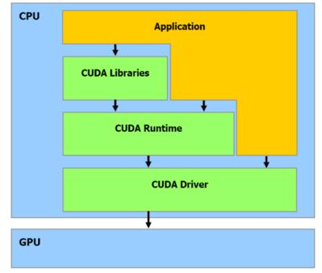
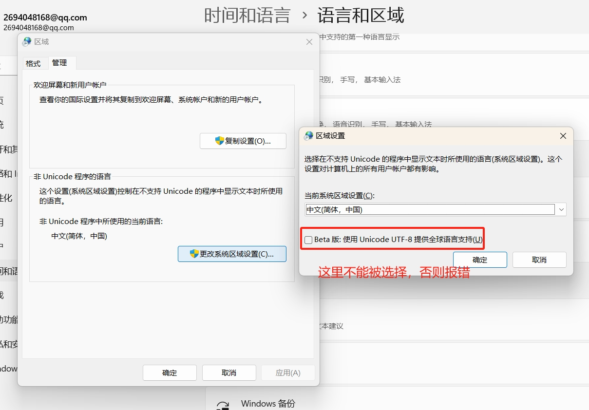
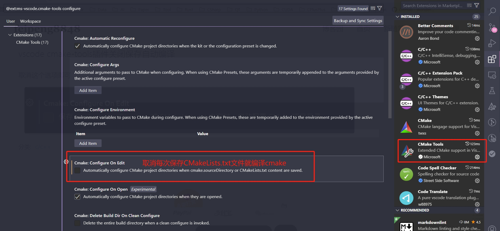

## The CUDA and TensorRT

### Features
- [x]CUDA Driver API
- [x]CUDA Runtime API
- [x]TensorRT Basic
- [x]TensorRT Advanced
- [x]Onnx and OnnxRuntime



### Build CUDA(*.cu) Error

- **不能设定UTF-8字符集(包括编译器的选项),出现莫名其妙的错误**




- [TensorRT Engine file read binary](https://github.com/NVIDIA/TensorRT/issues/453)

```shell
# Windows install netron
winget install -s winget netron

```

### Reference
- [OnnxRuntime](https://onnxruntime.ai/)
- [OnnxRuntime on GitHub](https://github.com/microsoft/onnxruntime)
- [NVIDIA TensorRT Tutorial repository](https://github.com/NVIDIA/trt-samples-for-hackathon-cn)
- [TensorRT download](https://developer.nvidia.com/tensorrt/download)
- [TensorRT Developer-Guide](https://docs.nvidia.com/deeplearning/tensorrt/developer-guide/index.html)
- [TensorRT C++ API](https://docs.nvidia.com/deeplearning/tensorrt/api/c_api/index.html)
- [TensorRT Python API](https://docs.nvidia.com/deeplearning/tensorrt/api/python_api/index.html)
- [ONNX on GitHub](https://github.com/onnx/onnx/tree/main)
- [ONNX-TensorRT on GitHub](https://github.com/onnx/onnx-tensorrt)
- [Netron on GitHub](https://github.com/lutzroeder/netron)
- [Visualize ONNX model via Netron online](https://netron.app/)
